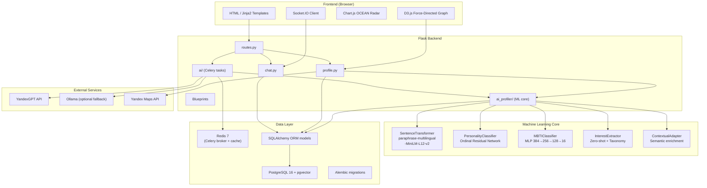
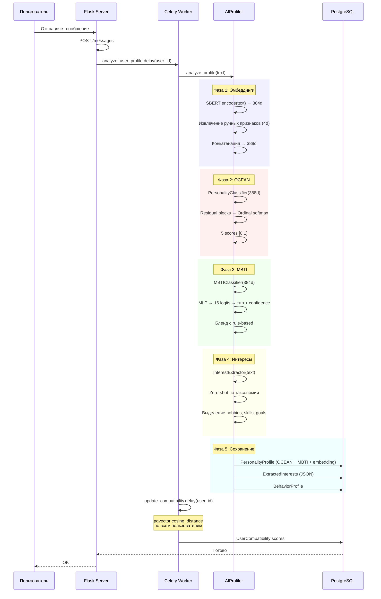
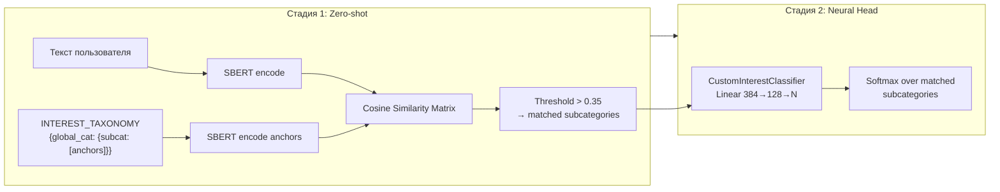
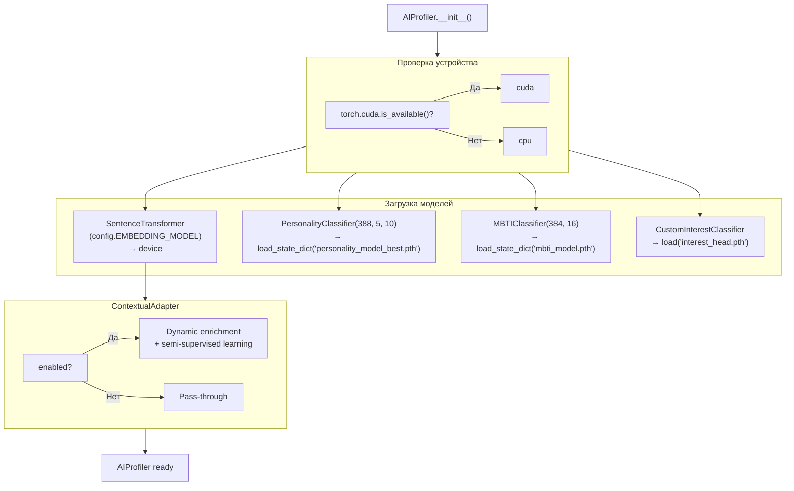

# Nexus Context — Техническая документация

## 1. Архитектура системы

### 1.1 High-level overview



### 1.2 Поток данных при анализе личности



---

## 2. ML-модели: устройство и обучение

### 2.1 PersonalityClassifier (OCEAN Big Five)

#### Архитектура

```
Вход: 388d (384 SBERT + 4 ручных признака)
  │
  ├── Linear(388, 256)          # Проекция
  ├── LayerNorm(256)
  ├── GELU
  ├── Dropout(p=0.2)
  │
  ├── ResidualBlock(256)        # Residual слой
  │   ├── Linear(256, 256)
  │   ├── LayerNorm
  │   ├── GELU
  │   ├── Dropout(0.15)
  │   ├── Linear(256, 256)
  │   ├── LayerNorm
  │   └── + skip → GELU
  │
  ├── Linear(256, 128)          # Bottleneck
  ├── LayerNorm(128)
  ├── GELU
  ├── Dropout(0.2)
  │
  ├── Linear(128, 5 × 10)       # Классификационная голова
  └── Reshape: (B, 5, 10)       # 5 traits × 10 ordinal bins
       │
       └── Softmax по bins → взвешенное ожидание → 5 scores [0, 1]
```

**Инициализация весов:**
- Все Linear слои: `kaiming_normal_(nonlinearity='relu')`, bias = 0
- Классификационная голова: `xavier_uniform_(gain=0.1)` — пониженный gain для стабильности

#### Ординальная регрессия

Выход сети — 10 бинов на каждую черту. Бинам соответствуют интервалы:

```
BIN_EDGES = [0.05, 0.15, 0.25, 0.35, 0.45, 0.55, 0.65, 0.75, 0.85, 0.95]
```

Преобразование логитов в скор:

```python
probs = softmax(logits)           # (B, 5, 10)
bin_values = [0.05, 0.15, ..., 0.95]
scores = sum(probs * bin_values)  # (B, 5) — взвешенное ожидание
```

#### Функция потерь: ordinal_loss

```python
# Для каждого trait: P(Y <= k) через cumsum по bins
cum_probs = cumsum(softmax(logits))[:, :, :-1]
# Таргет: бинаризация
cum_targets = (target_bins <= k_range).float()
# Label smoothing (0.02)
cum_targets = cum_targets * 0.98 + (1 - cum_targets) * 0.02
# Binary cross-entropy по кумулятивным вероятностям
loss = BCE(cum_probs, cum_targets)
```

#### Гиперпараметры

| Параметр | Значение | Пояснение |
|----------|----------|-----------|
| `lr` | 3e-4 | Начальный learning rate |
| `weight_decay` | 1e-5 | L2-регуляризация |
| `batch_size` | 32 | Размер батча |
| `epochs` | 200 | Максимум эпох |
| `es_patience` | 40 | Early stopping по R² |
| `scheduler` | ReduceLROnPlateau | factor=0.5, patience=12, mode='max' |
| `grad_clip` | 1.0 | Clip grad norm |
| `label_smoothing` | 0.02 | Для ordinal BCE |

#### Данные

| Источник | Записей | Вес |
|----------|---------|-----|
| generated_data_ocean.json (сгенерированный) | ~17 000 | 1.0 |
| **Итого** | **~17 000** | — |
| Train/Val split | 85/15 | random_seed=42 |

**Ручные признаки (4 шт.):**
1. `min(len(text) / 1000, 1.0)` — нормированная длина
2. `caps_ratio` — доля заглавных букв среди буквенных
3. `min(excl_count / 5, 1.0)` — частота `!`
4. `min(ques_count / 5, 1.0)` — частота `?`

#### Результаты

| Метрика | Значение |
|---------|----------|
| **R² (лучший)** | 0.6724 |
| **MAE (лучший)** | 0.0621 |
| **Эпоха лучшего R²** | ~60 |
| **Финальный Val Loss** | ~0.35 |

#### Запуск

```bash
cd ml
python preprocess.py --input data/generated_data_ocean.json --output data/train_data_precomputed.json
python precompute_embedding.py
python train_ocean.py
```

---

### 2.2 MBTIClassifier

#### Архитектура

```
Вход: 384d (SBERT эмбеддинг)
  │
  ├── Linear(384, 256)
  ├── LayerNorm(256)
  ├── GELU
  ├── Dropout(p=0.3)
  │
  ├── Linear(256, 128)
  ├── LayerNorm(128)
  ├── GELU
  ├── Dropout(p=0.2)
  │
  └── Linear(128, 16) → softmax → 16 MBTI типов
```

#### Бленд нейросети и rule-based

Итоговый MBTI-тип вычисляется как взвешенная комбинация:

```python
mbti_type = blend_neural_rule_based(
    neural_logits,       # из MBTIClassifier
    rule_based_type,     # из анализа текста (ключевые слова, стиль)
    blend_weight=config.MBTI_NEURAL_BLEND_WEIGHT  # 0.7
)
```

**Rule-based компонент** анализирует:
- Длину сообщения (экстраверты пишут короче)
- Категорию узлов графа (T/F, N/S преференс)
- Использование эмодзи, слэнга, пунктуации

#### Гиперпараметры

| Параметр | Значение |
|----------|----------|
| lr | 5e-4 |
| weight_decay | 0.01 |
| batch_size | 64 |
| optimizer | AdamW |
| scheduler | нет |
| early_stopping_patience | 12 эпох |
| loss | CrossEntropyLoss |

#### Данные

Сгенерированный набор текстов с метками MBTI.
- Сплит 80/20 стратифицированный
- WeightedRandomSampler для балансировки классов
- Наиболее редкие типы: INFJ, ENFJ, INTJ

#### Результаты

| Метрика | Значение |
|---------|----------|
| **Val Accuracy** | ~72% |
| **Базовая линия (random)** | 6.25% |
| **Улучшение** | ~11.5x |

#### Запуск

```bash
cd ml
python train_mbti.py  # → artifacts/mbti_model.pth
```

---

### 2.3 InterestExtractor (Zero-shot + Neural Head)

#### Двухстадийный подход



#### Таксономия

```python
INTEREST_TAXONOMY = {
    "work": {
        "it_development": ["Python", "backend", "web dev", ...],
        "data_science": ["ML", "neural networks", "statistics", ...],
        "design": ["UI/UX", "graphic design", "Figma", ...],
        # ... ~15 подкатегорий
    },
    "hobby": {
        "music_audio": ["guitar", "producing", "concerts", ...],
        "sports": ["football", "gym", "running", ...],
        "gaming": ["Dota 2", "CS", "RPG", ...],
        # ... ~20 подкатегорий
    },
    "psychology": {
        "self_development": ["meditation", "habits", "growth", ...],
        "relationship": ["attachment theory", "love languages", ...],
        # ... ~8 подкатегорий
    },
    "want": {
        "career": ["find job", "promotion", "startup", ...],
        "education": ["learn", "course", "university", ...],
        # ... ~6 подкатегорий
    }
}
```

#### Neural Head (CustomInterestClassifier)

```python
class CustomInterestClassifier:
    def __init__(self, embedding_dim=384, labels=[], hidden_dim=128, dropout=0.3):
        self.classifier = nn.Sequential(
            nn.Linear(embedding_dim, hidden_dim),
            nn.ReLU(),
            nn.Dropout(dropout),
            nn.Linear(hidden_dim, len(labels)),
        )
```

Обучается на якорных текстах из таксономии:
- Каждый anchor → embedding → класс (глобальная_категория, подкатегория)
- 15 эпох, lr=0.001, CrossEntropyLoss
- Сохраняется в `ml/artifacts/interest_head.pth`

#### Запуск

```bash
cd ml
python train_interest_head.py
```

---

### 2.4 Fine-tuning SBERT (шаблон)

Для улучшения семантической близости сленга и канонических описаний:

```bash
python finetune_sbert.py \
    --pairs data/slang_pairs.json \
    --output ml/artifacts/sbert-finetuned \
    --epochs 3 \
    --batch-size 16
```

**Loss**: MultipleNegativesRankingLoss — anchor и positive сближаются, остальные примеры батча — in-batch negatives.

**Встроенный датасет** — pairs из `app/ai_profiler/semantic_ontology.py`.

**Экспорт шаблона** для ручного сбора пар:
```bash
python finetune_sbert.py --export-template data/pairs_template.json
```

---

## 3. Алгоритмы поиска и ранжирования

### 3.1 Гибридный скор совместимости

```
final_score = w_graph * graph_score
            + w_ocean * ocean_sim
            + w_jaccard * jaccard_sim
            + w_schwartz * schwartz_sim
            + w_root * root_score
```

Где веса `w_*` корректируются микро-градиентным шагом на основе персональных смещений:

```python
w_graph = GLOBAL_WEIGHT_GRAPH + user.metric_weight_graph_offset * 0.01
w_ocean = GLOBAL_WEIGHT_OCEAN + user.metric_weight_ocean_offset * 0.01
# и т.д.
```

### 3.2 Graph Score

Пересечение весов интересов между пользователями по узлам графа знаний. Чем больше общих тегов с высоким весом — тем выше скор.

### 3.3 OCEAN Similarity

Косинусное расстояние между 5-мерными OCEAN-векторами:

```python
similarity = 1 - profile.embedding.cosine_distance(my.embedding)
```

### 3.4 Schwartz Similarity

Взвешенная корреляция Пирсона по 10 ценностям Шварц.

### 3.5 Root Personality Score

Совпадение корневого архетипа (work / hobby / psychology). Категориальный матч:

```python
root_score = 1.0 if user.root == candidate.root else 0.3
```

### 3.6 Micro-gradient step

Персональная калибровка весов на основе обратной связи (лайки, просмотры, начало чата):

```python
for metric in ['ocean', 'graph', 'jaccard', 'schwartz']:
    if feedback_positive:
        user.metric_weight_{metric}_offset += 0.1
    else:
        user.metric_weight_{metric}_offset -= 0.05
```

---

## 4. Инференс: загрузка и запуск моделей



Все модели кэшируются в singleton `AIProfiler` при первом вызове `AIProfiler()`.

---

## 5. Результаты и метрики

### Сводная таблица

| Модель | Метрика | Значение | Датасет | Размер |
|--------|---------|----------|---------|--------|
| OCEAN | R² | 0.6724 | ~17 000 | 10.2 MB .pth |
| OCEAN | MAE | 0.0621 | ~17 000 | — |
| MBTI | Accuracy | ~72% | Сгенерированный | 0.8 MB .pth |
| MBTI | Baseline | 6.25% | — | — |
| Interest Head | Accuracy | ~85% (val) | anchors | 0.3 MB .pth |
| SBERT | embedding dim | 384 | — | 470 MB |

### График обучения OCEAN

---

## 6. Структура папки ml/

```
ml/
├── train_ocean.py              # OCEAN PersonalityClassifier (орд. регрессия)
├── train_mbti.py               # MBTI классификатор (MLP)
├── train_interest_head.py      # Interest Head (Linear projection)
├── finetune_sbert.py           # Fine-tuning SBERT (MNRL)
├── preprocess.py               # Извлечение 388d признаков
├── prepare_dataset.py          # Объединение и перемешивание датасетов
├── precompute_embedding.py     # Прекомпьютинг эмбеддингов в .pt
├── test_model.py               # Тест инференса AIProfiler
│
    ├── data/
    │   ├── generated_data_ocean.json  # Сгенерированные OCEAN-примеры
    │   └── train_data_precomputed.pt  # Прекомпьюченные тензоры (388d)
│
└── artifacts/
    ├── personality_model_best.pth   # OCEAN веса (best R²)
    ├── mbti_model.pth               # MBTI веса
    ├── interest_head.pth           # Interest Head веса
    ├── v1.pth / v1best.pth         # Исторические версии
    ├── v2.pth / v2_best.pth
    ├── v3.pth / v3_best.pth
    ├── v4.pth / v4_best.pth
    ├── model_stub.json             # Заглушка
    └── training_history.png        # График обучения OCEAN
```

---

## 7. Ключевые зависимости Python

```text
torch>=2.0.0
sentence-transformers>=2.2.0
transformers>=4.30.0
nltk>=3.8
scikit-learn>=1.3
numpy>=1.24
pandas>=2.0
matplotlib>=3.7
tqdm>=4.65
```

---

*Документация поддерживается в актуальном состоянии. Последнее обновление: июль 2026.*
